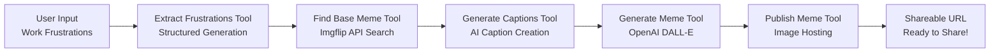

# Mastra Workshop: AI-Powered Meme Generator

Welcome to the **Mastra Workshop**! This project demonstrates how to build **AI agents and tools** using Mastra to create a fun meme generation workflow that turns workplace frustrations into shareable memes.

## 🎯 What You'll Learn

- **Mastra Agents**: Build conversational AI agents that can understand user input
- **Mastra Tools**: Create modular tools that agents can use to accomplish tasks
- **Structured Generation**: Use Vercel AI SDK with Zod schemas for reliable data extraction
- **External API Integration**: Connect to meme services and image generation APIs
- **Agentic Workflows**: Chain multiple tools together to create complex workflows

## 🧠 Understanding the Workflow

### The Meme Generation Pipeline

Our workshop demonstrates a complete agentic workflow:



### Key Components

1. **Frustration Extraction Tool**: Uses structured generation to parse user input into categorized frustrations
2. **Meme Search Tool**: Searches Imgflip's free API for appropriate base meme templates
3. **Caption Generation Tool**: Creates witty, contextual captions based on frustrations and meme template
4. **Meme Generation Tool**: Uses OpenAI's DALL-E to create custom memes with the base template and captions
5. **Meme Publishing Tool**: Uploads the generated meme to a hosting service

## 🚀 Quick Start

### Prerequisites

- Node.js 18+ 
- OpenAI API key (for caption generation and image creation)
- Basic knowledge of Next.js and TypeScript

### 1. Clone and Install

```bash
git clone <your-repo-url>
cd mastra-workshop-test
npm install
```

### 2. Environment Setup

Create a `.env` file with your API keys:

```env
# OpenAI Configuration (required for caption generation and image creation)
OPENAI_API_KEY=your_openai_api_key_here
```

### 3. Start the Development Server

```bash
npm run dev
```

Visit [http://localhost:4111](http://localhost:4111) to start generating memes!

## 🤖 How It Works

### The Meme Agent

Our main agent understands user frustrations and orchestrates the meme generation process:

```typescript
// Simplified agent structure
const memeAgent = new Agent({
  name: "MemeGenerator",
  instructions: "Help users turn their work frustrations into funny memes",
  tools: {
    extractFrustrations: extractFrustrationsTools,
    findBaseMeme: findBaseMemeTools,
    generateCaptions: generateCaptionsTools,
    generateMeme: generateMemeTools,
    publishMeme: publishMemeTools
  }
});
```

### Tool Architecture

Each tool in our workflow is designed to be:
- **Modular**: Can be used independently or as part of the workflow
- **Typed**: Uses Zod schemas for input/output validation
- **Testable**: Can be tested in isolation using Mastra's testing tools
- **Reusable**: Can be composed into different workflows

## 🔧 Workshop Exercises

### Exercise 1: Enhance Frustration Extraction

Improve the frustration extraction tool to categorize frustrations by:
- Department (Engineering, Sales, Marketing, etc.)
- Severity (Mild annoyance, Major blocker, etc.)
- Type (Process, People, Technology, etc.)

### Exercise 2: Add Caption Style Variations

Extend the caption generation to support different styles:
- Professional/workplace-safe captions
- Casual/friendly captions  
- Sarcastic/edgy captions
- Industry-specific humor (tech, sales, etc.)

### Exercise 3: Create a Meme Gallery

Build a tool that:
- Stores generated memes in a local database
- Creates a gallery view of past memes
- Allows users to regenerate variations of successful memes

### Exercise 4: Add Social Sharing

Implement tools for:
- Direct sharing to Slack channels
- Generating QR codes for easy mobile sharing
- Creating meme collections for team retrospectives

## 🛠️ Tools Deep Dive

### 1. Extract Frustrations Tool

```typescript
const extractFrustrationsTools = createTool({
  id: "extract-frustrations",
  description: "Extract and categorize user frustrations from raw input",
  inputSchema: z.object({
    userInput: z.string().describe("Raw user input about work frustrations")
  }),
  execute: async ({ context: { userInput } }) => {
    // Uses Vercel AI SDK with structured generation
    const result = await generateObject({
      model: openai('gpt-4'),
      schema: frustrationsSchema,
      prompt: `Extract frustrations from: ${userInput}`
    });
    return result.object;
  }
});
```

### 2. Find Base Meme Tool

```typescript
const findBaseMemeTools = createTool({
  id: "find-base-meme",
  description: "Search for appropriate meme templates using Imgflip's free API",
  inputSchema: z.object({
    frustrations: frustrationsSchema,
    style: z.string().optional()
  }),
  execute: async ({ context: { frustrations, style } }) => {
    // Search Imgflip's free API for relevant meme templates
    const response = await fetch('https://api.imgflip.com/get_memes');
    const templates = await filterRelevantMemes(response, frustrations);
    return { templates };
  }
});
```

### 3. Generate Captions Tool

```typescript
const generateCaptionsTools = createTool({
  id: "generate-captions",
  description: "Generate meme captions based on frustrations and template",
  inputSchema: z.object({
    frustrations: frustrationsSchema,
    baseTemplate: baseTemplateSchema,
    style: z.enum(["workplace_safe", "casual", "sarcastic"]).optional()
  }),
  execute: async ({ context: { frustrations, baseTemplate, style } }) => {
    // Generate contextual, funny captions using AI
    const captions = await generateObject({
      model: openai('gpt-4'),
      schema: captionsSchema,
      prompt: `Create funny captions for ${baseTemplate.name} based on: ${frustrations}`
    });
    return captions.object;
  }
});
```

### 4. Generate Meme Tool

```typescript
const generateMemeTools = createTool({
  id: "generate-meme",
  description: "Create custom meme using OpenAI with base template and captions",
  inputSchema: z.object({
    baseTemplate: baseTemplateSchema,
    captions: captionsSchema,
    style: z.enum(["photorealistic", "cartoon", "classic_meme"]).optional()
  }),
  execute: async ({ context: { baseTemplate, captions, style } }) => {
    // Use OpenAI DALL-E to create meme with specific template and text
    const memeImage = await generateMemeImage(baseTemplate, captions, style);
    return { imageUrl: memeImage.url };
  }
});
```

### 5. Publish Meme Tool

```typescript
const publishMemeTools = createTool({
  id: "publish-meme",
  description: "Upload meme to hosting service and get shareable URL",
  inputSchema: z.object({
    imageUrl: z.string(),
    title: z.string().optional()
  }),
  execute: async ({ context: { imageUrl, title } }) => {
    // Upload to Imgur for free hosting with fallback handling
    const hostedUrl = await uploadToImageHost(imageUrl, title);
    return { shareableUrl: hostedUrl };
  }
});
```

## 🧪 Testing Your Tools

### Local Testing with Mastra

Mastra provides excellent testing capabilities for your tools:

```bash
# Test individual tools
npx mastra test tools extract-frustrations

# Test the complete workflow
npx mastra test workflow meme-generation

# Interactive testing in the browser
npm run dev
# Visit the Mastra playground
```

### Example Test Cases

1. **Simple Frustration**: "My meetings always run over time"
2. **Complex Frustration**: "The deployment process is broken, code reviews take forever, and our standup meetings are pointless"
3. **Emotional Frustration**: "I'm so tired of explaining the same thing over and over to different stakeholders"

## 🎨 Customization Ideas

### Meme Styles
- **Corporate Humor**: Professional-looking memes safe for work
- **Developer Memes**: Programming and tech-specific templates
- **Remote Work**: Memes about working from home challenges
- **Meeting Memes**: Specifically about meeting frustrations

### Integration Options
- **Slack Bot**: Deploy as a Slack app for team use
- **Teams Integration**: Microsoft Teams bot for enterprise
- **Discord Bot**: For gaming/tech communities
- **Web Widget**: Embeddable meme generator for websites

## 🐛 Troubleshooting

### Common Issues

1. **OpenAI API Errors**
   - Verify your API key is correct and has sufficient credits
   - Check rate limits if getting 429 errors
   - Ensure you have access to DALL-E image generation

2. **Imgflip API Issues**
   - The free API works without authentication for basic features
   - Check API rate limits if making many requests
   - Verify internet connectivity

3. **Image Hosting Problems**
   - Verify the hosting service is accessible
   - Check file size limits
   - Ensure proper image format (PNG, JPEG)

### Debug Resources

- **Tool Testing**: Use Mastra's built-in testing tools
- **API Logs**: Check browser network tab for API call details
- **Error Handling**: All tools include comprehensive error handling

## 📖 Learn More

### Documentation

- [Mastra Documentation](https://mastra.ai/docs)
- [Vercel AI SDK](https://sdk.vercel.ai/docs)
- [OpenAI API Documentation](https://platform.openai.com/docs)
- [Imgflip API](https://imgflip.com/api)

### Key Concepts

- **Agent Orchestration**: How agents coordinate multiple tools
- **Structured Generation**: Reliable data extraction from LLMs
- **Tool Composition**: Building complex workflows from simple tools
- **Error Handling**: Graceful failure and recovery in agentic systems
- **Testing Strategies**: How to test AI-powered workflows

## 🎉 Workshop Goals

By the end of this workshop, you'll have:

- ✅ Built a complete agentic workflow with multiple specialized tools
- ✅ Integrated external APIs (Imgflip, OpenAI, image hosting)
- ✅ Used structured generation for reliable data extraction
- ✅ Created a fun, shareable application that solves real problems
- ✅ Learned Mastra's agent and tool patterns
- ✅ Gained experience with AI-powered workflows and tool composition

## 🤝 Contributing

Found an issue or want to improve the workshop? Please open an issue or submit a pull request!

## 📄 License

MIT License - feel free to use this code for your own projects and workshops.

---

**Happy meme generating!** 🎭 Turn those work frustrations into laughs and learn about agentic AI workflows in the process! 