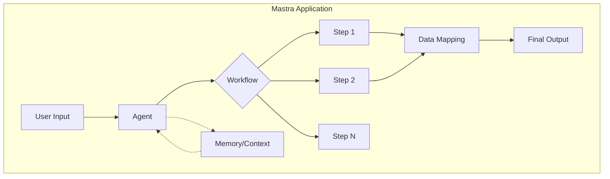
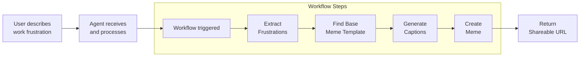

# AI Pipelines and Agents in Pure TypeScript with Mastra.ai

Welcome to this hands-on workshop! This project demonstrates how to build **production-ready AI agents and workflows** using Mastra to create a fun meme generation pipeline that turns workplace frustrations into shareable memes.

While we've chosen a humorous implementation example, the **patterns, architecture, and Mastra framework** you'll learn here are ideal for creating **enterprise-grade agentic applications**. The same workflow concepts apply whether you're building customer support automation, data processing pipelines, or complex business logic orchestration.

## 🎯 What You'll Learn

- **Mastra Agents**: Build conversational AI agents that can understand user input and execute workflows
- **Mastra Workflows**: Create modular, reusable workflow steps that can be chained together
- **Structured Generation**: Use Vercel AI SDK with Zod schemas for reliable data extraction
- **External API Integration**: Connect to external services (Imgflip) for specialized functionality
- **Data Flow Management**: Learn how to map and transform data between workflow steps

## 🧠 Understanding Mastra Concepts

### What is Mastra?

Mastra is a TypeScript framework for building AI-powered applications with:
- **Agents**: Conversational AI that can understand context and execute actions
- **Workflows**: Composable chains of steps that process data
- **Memory**: Built-in conversation history and context management
- **Type Safety**: Full TypeScript support with runtime validation via Zod

### Core Architecture



### Key Concepts Explained

1. **Agents**: AI-powered entities that understand natural language and can execute workflows
2. **Workflows**: Declarative chains of steps with automatic data flow management
3. **Steps**: Individual, reusable units of work with typed inputs/outputs
4. **Data Mapping**: Transform and combine outputs from multiple steps

## 🎭 The Meme Generation Workflow

### High-Level Flow



### Detailed Data Flow

```mermaid
flowchart TD
    Start([User Input:<br/>"My meetings always<br/>run over time"]) --> Step1[Extract Frustrations Step]
    
    Step1 --> Data1{Output:<br/>frustrations object}
    Data1 --> |"frustrations"| Step2[Find Base Meme Step]
    
    Step2 --> Data2{Output:<br/>meme templates array}
    
    Data1 --> |"map data"| Map1[Data Mapping 1]
    Data2 --> |"map data"| Map1
    Map1 --> |"{frustrations, baseTemplate}"| Step3[Generate Captions Step]
    
    Step3 --> Data3{Output:<br/>captions object}
    
    Data2 --> |"map data"| Map2[Data Mapping 2]
    Data3 --> |"map data"| Map2
    Map2 --> |"{baseTemplate, captions}"| Step4[Generate Meme Step]
    
    Step4 --> Data4{Output:<br/>imageUrl, pageUrl}
    
    Data4 --> End([Final Output:<br/>Shareable meme URL])
    
    style Start fill:#e1f5fe
    style End fill:#c8e6c9
    style Map1 fill:#fff3e0
    style Map2 fill:#fff3e0
```

### Step Details

Each step in our workflow demonstrates key Mastra patterns:

#### 1. Extract Frustrations Step
- **Purpose**: Parse unstructured user input into structured data
- **Key Concept**: Structured generation with Zod schemas
- **Input**: Raw string
- **Output**: Categorized frustrations object

#### 2. Find Base Meme Step
- **Purpose**: Search for appropriate meme templates
- **Key Concept**: External API integration
- **Input**: Frustrations data
- **Output**: Array of meme templates

#### 3. Generate Captions Step
- **Purpose**: Create contextual, funny captions
- **Key Concept**: AI-powered content generation
- **Input**: Frustrations + selected template
- **Output**: Top and bottom text for meme

#### 4. Generate Meme Step
- **Purpose**: Create the actual meme image
- **Key Concept**: API-based image generation
- **Input**: Template + captions
- **Output**: Shareable meme URL

## 🚀 Quick Start

### Prerequisites

- Node.js 20.9.0+
- OpenAI API key (for caption generation)
- Optional: Imgflip account credentials (for better rate limits)

### 1. Clone and Install

```bash
git clone <your-repo-url>
cd ai-eng-world-faire-workshop
npm install
```

### 2. Environment Setup

Create a `.env` file:

```env
# Required: OpenAI for AI-powered features
OPENAI_API_KEY=your_openai_api_key_here

# Optional: Imgflip credentials for better reliability
IMGFLIP_USERNAME=your_imgflip_username
IMGFLIP_PASSWORD=your_imgflip_password
```

### 3. Start Development

```bash
npm run dev
```

Visit [http://localhost:4111](http://localhost:4111) to start generating memes!

## 🔍 Code Deep Dive

### Understanding the Workflow Definition

```typescript
// 1. Define the workflow with schemas
export const memeGenerationWorkflow = createWorkflow({
  id: 'meme-generation',
  inputSchema: z.object({
    userInput: z.string()
  }),
  outputSchema: z.object({
    shareableUrl: z.string(),
    pageUrl: z.string().optional(),
  }),
  steps: [/* steps array for UI */],
});

// 2. Build the execution chain
memeGenerationWorkflow
  .then(extractFrustrationsStep)
  .then(findBaseMemeStep)
  .map({
    // Data mapping: combine outputs for next step
    frustrations: {
      step: extractFrustrationsStep,
      path: '.', // Use entire output
    },
    baseTemplate: {
      step: findBaseMemeStep,
      path: 'templates.0', // First template
    },
  })
  .then(generateCaptionsStep)
  // ... more steps
  .commit(); // Finalize the workflow
```

### Key Patterns to Notice

1. **Declarative Workflow Building**: Chain steps with `.then()`
2. **Data Mapping**: Use `.map()` to reshape data between steps
3. **Path Selection**: Extract specific fields with JSONPath-like syntax
4. **Type Safety**: All data transformations are type-checked

## 📚 Common Pitfalls and Solutions

### Pitfall 1: Forgetting Data Mapping
```typescript
// ❌ Wrong: Next step won't have required data
workflow
  .then(step1)
  .then(step2) // Needs data from step1 AND step2

// ✅ Correct: Map data before the step
workflow
  .then(step1)
  .then(step2)
  .map({
    dataFromStep1: { step: step1, path: '.' },
    dataFromStep2: { step: step2, path: '.' },
  })
  .then(step3)
```

### Pitfall 2: Incorrect Path Selection
```typescript
// ❌ Wrong: Path doesn't match output structure
.map({
  template: { step: findBaseMemeStep, path: 'template' }
})

// ✅ Correct: Match the actual output structure
.map({
  baseTemplate: { step: findBaseMemeStep, path: 'templates.0' }
})
```

### Pitfall 3: Schema Mismatches
```typescript
// ❌ Wrong: Output schema doesn't match step output
outputSchema: z.object({
  memeUrl: z.string() // Step returns 'imageUrl'
})

// ✅ Correct: Match the actual field names
outputSchema: z.object({
  shareableUrl: z.string() // Mapped from 'imageUrl'
})
```

## 🧪 Testing Your Workflow

### Using the Mastra Playground

1. Start the dev server: `npm run dev`
2. Navigate to http://localhost:4111
3. Try these test inputs:
   - "My meetings always run over time"
   - "The deployment broke on Friday afternoon"
   - "I explained this feature three times today"

### Understanding the Agent Logs

```
🎨 Creating meme using imgflip API...
✅ Meme generated successfully!
🔗 Image URL: https://i.imgflip.com/...
```

## 🎓 Learning Exercises

### Exercise 1: Add a New Step
Try adding a step that analyzes the humor level of the generated meme.

### Exercise 2: Enhance Error Handling
Add retry logic for API failures in the meme generation step.

### Exercise 3: Create a New Workflow
Build a workflow that generates motivational quotes instead of memes.

## 📖 Additional Resources

### Mastra Documentation
- [Getting Started](https://mastra.ai/docs/getting-started)
- [Agents Guide](https://mastra.ai/docs/agents)
- [Workflows Guide](https://mastra.ai/docs/workflows)
- [API Reference](https://mastra.ai/docs/reference)

### Related Technologies
- [Vercel AI SDK](https://sdk.vercel.ai/docs)
- [Zod Schema Validation](https://zod.dev)
- [Imgflip API Documentation](https://imgflip.com/api)

## 🎉 What's Next?

Now that you understand the basics, try:

1. **Extending the workflow**: Add sentiment analysis or emotion detection
2. **Building new agents**: Create agents for different domains
3. **Integrating with your apps**: Use Mastra in your existing projects
4. **Exploring advanced features**: Parallel steps, conditional logic, error handling

## 🤝 Contributing

Found an issue or have an improvement? We'd love your contribution!

1. Fork the repository
2. Create your feature branch
3. Commit your changes
4. Push to the branch
5. Open a Pull Request

## 📄 License

MIT License - feel free to use this code for your own projects!

---

**Happy coding!** 🚀 Build amazing AI-powered applications with Mastra!