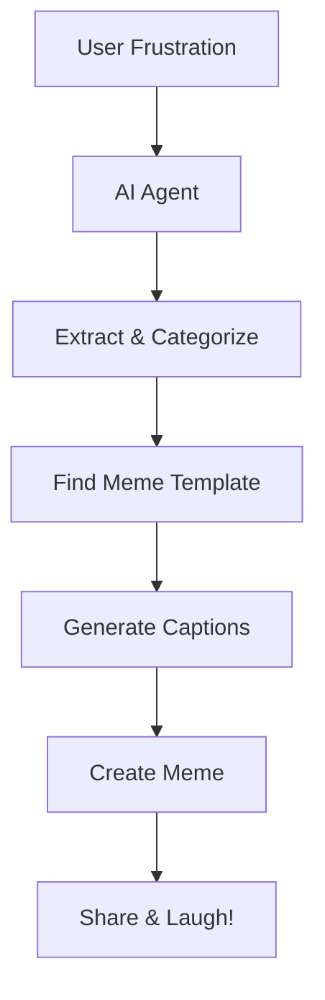

# AI Pipelines and Agents in Pure TypeScript with Mastra.ai

---
layout: two-cols
---

# Welcome! 👋

<div class="text-xl">

**Today's Mission:**  
Build an AI-powered meme generator that transforms workplace frustrations into shareable content

Find the materials in the `#workshop-ai-agents-with-mastra` channel in Slack!

**Format:**
- 20 min intro & concepts
- 90 min hands-on coding
- 10 min wrap-up & Q&A

</div>

::right::

<div class="pl-8 pt-8">



</div>

---
layout: image-right
image: /workos.webp
---

# WorkOS

We build developer tools that make enterprise features easy:

- **SSO/SAML** - Enterprise authentication
- **Directory Sync** - SCIM protocol  
- **Audit Logs** - Compliance-ready events
- **Fine-Grained Authorization** - Advanced permissions
- **Auth for your AI** - Secure MCP servers and attach identity to agents

---
layout: image-right
image: /nick.jpg
---

# Nick Nisi

## Developer Experience @ WorkOS

- 🎙️ Host on Dysfunctional.fm (formerly JS Party)
- 🎤 Conference Emcee and speaker (NEJS Conf, TS Conf, SquiggleConf)
- 💻 TypeScript enthusiast
- 🔧 Vim user (btw)
- 🌐 @nicknisi everywhere

---
layout: image
image: /zack.png
---

---

# What is Mastra? 

<div class="grid grid-cols-2 gap-8 pt-4">

<div>

## The Framework

**Mastra** is a TypeScript framework for building AI applications with:

- 🔄 **Workflows** - Composable, typed pipelines
- 🔧 **Tools** - Reusable functions agents can call
- 🤖 **Agents** - Stateful AI entities with memory
- 💾 **Built-in persistence** - Conversation memory
- 🔍 **Observability** - See what your AI is doing
- 🟰 Evaluation - Mastra can tell you the health of your pipeline over time

</div>

<div>

## Why Mastra?

```typescript
// Type-safe from end to end
const workflow = createWorkflow({
  inputSchema: z.object({
    frustration: z.string()
  }),
  outputSchema: z.object({
    memeUrl: z.string()
  }),
  steps: [extractStep, generateStep]
});

// Agents that just work
const agent = new Agent({
  name: 'MemeBot',
  workflows: { memeGen: workflow }
});
```

</div>

</div>

---
layout: center
---

# Core Concepts

Let's understand the building blocks before we code

---

# Workflows 🔄

<div class="grid grid-cols-2 gap-8">

<div>

## What are Workflows?

**Workflows** are composable pipelines that:
- Chain multiple steps together
- Pass data between steps  
- Validate inputs/outputs with Zod
- Handle errors gracefully

Think of them as **typed, observable functions** that can do complex multi-step operations.

</div>

<div>

```typescript
// Define a workflow
const memeWorkflow = createWorkflow({
  id: 'generate-meme',
  steps: [
    extractFrustrations,
    findMemeTemplate,
    generateCaptions,
    createMeme
  ]
});

// Chain steps with data flow
workflow
  .then(extractStep)
  .map({ 
    // Map data between steps
    template: { 
      step: extractStep, 
      path: 'suggestedTemplate' 
    }
  })
  .then(generateStep)
  .commit();
```

</div>

</div>

---

# Tools 🔧

<div class="grid grid-cols-2 gap-8">

<div>

## What are Tools?

**Tools** are functions that agents can call:
- File system access
- API calls
- Database queries
- Custom business logic

They extend what your AI can **actually do** beyond just chatting.

<div class="mt-4 p-4 bg-blue-500 bg-opacity-20 rounded">
💡 **Note:** We won't use tools today, but they're key for production apps where agents need to interact with external systems.
</div>

</div>

<div>

```typescript
// Example tool definition
const searchMemeTool = createTool({
  id: 'search-memes',
  description: 'Search for meme templates',
  inputSchema: z.object({
    query: z.string(),
    limit: z.number().optional()
  }),
  execute: async ({ query, limit = 10 }) => {
    const results = await imgflipAPI.search({
      q: query,
      num: limit
    });
    return results;
  }
});

// Agents can use tools autonomously
const agent = new Agent({
  tools: { searchMeme: searchMemeTool }
});
```

</div>

</div>

---

# Agents 🤖

<div class="grid grid-cols-2 gap-8">

<div>

## What are Agents?

**Agents** are stateful AI entities that:
- Maintain conversation memory
- Execute workflows autonomously
- Make decisions based on context
- Use tools to complete tasks

Think of them as **AI assistants with both memory and capabilities**.

</div>

<div>

```typescript
const memeAgent = new Agent({
  name: 'MemeGenerator',
  instructions: `
    You help people turn frustrations 
    into funny memes. When someone 
    shares a frustration, immediately 
    run the meme workflow.
  `,
  model: openai('gpt-4'),
  memory: storage,
  workflows: {
    'meme-gen': memeWorkflow
  }
});

// Agent maintains context
await agent.generate(
  "My meetings always run over", 
  { resourceId: "user-123" }
);
```

</div>

</div>

---

# Model Context Protocol (MCP) 🔌

<div class="grid grid-cols-2 gap-8">

<div>

## What is MCP?

**Model Context Protocol** is an open standard that acts like a **"universal plugin system for AI agents"**:

- 🔗 **Standardized connections** between AI models and external tools
- 🌐 **Cross-platform compatibility** across languages and environments
- 🔄 **Dynamic tool discovery** - agents find and use tools on demand
- 🛡️ **Auth** with platforms such as WorkOS - secure access and get context from identity

Think of it as **USB for AI** - one standard, many tools.

</div>

<div>

## How Mastra Uses MCP

```typescript
// Static configuration (single-user)
const mastra = new Mastra({
  tools: {
    mcp: {
      servers: {
        filesystem: {
          command: 'npx',
          args: ['@modelcontextprotocol/server-filesystem', '/tmp']
        }
      }
    }
  }
});

// Dynamic configuration (multi-user)
const tools = await getMCPTools(userId);
const agent = new Agent({ tools });
```

**Benefits:** Agents can access file systems, databases, APIs, and custom business logic through one unified interface.

</div>

</div>

---
layout: cover
---

# mcp.shop

---
layout: two-cols
---

# MCP Night

- Powered by WorkOS
- Fun night of demos, discussions, and panels around MCP
- Follow us to hear about the next one

::right::

<video autoplay muted loop class="w-full h-full object-cover">
  <source src="/mcpnight.mov" type="video/mp4">
  Your browser does not support the video tag.
</video>


---
layout: center
---

# Today's Build

## AI Meme Generator 🎭

Transform workplace frustrations into shareable memes using:
- **Workflows** to process and generate
- **Agents** to provide conversational interface
- **OpenAI** for understanding and creativity
- **Imgflip** for meme generation

---

# Workshop Format 📋

<div class="grid grid-cols-2 gap-8">

<div>

## Self-Paced Learning

1. **Clone the repo** and start at `step-0`
2. **Follow WORKSHOP.md** at your own pace
3. **Complete each step** before moving on
4. **Use branch checkpoints** if you fall behind

## Checkpoint Schedule

- **0:20** - Should complete Step 0 (Setup)
- **0:40** - Should complete Step 1 (First workflow)
- **1:00** - Should complete Step 2 (Full workflow)
- **1:20** - Should complete Step 3 (Agent)
- **1:40** - Should complete Step 4 (Polish)

</div>

<div>

## Getting Unstuck

### If you fall behind:
```bash
git checkout steps/step-2
npm install
```

### If you need help:
- 🙋 Raise your hand
- 💬 Ask in chat
- 👀 Check the solution branch

### Remember:
- **Quality > Speed**
- **Understanding > Completion**
- **It's OK to explore!**

</div>

</div>

---
layout: fact
---

# Let's Build! 🚀

## Get Started:

### `#workshop-ai-agents-with-mastra`

```bash
git clone git@github.com:workos/mastra-agents-meme-generator.git
cd mastra-agents-meme-generator
git checkout steps/step-0
npm install
```

<div class="mt-8 text-2xl">
Open <code>WORKSHOP.md</code> and begin!
</div>

---

# Checkpoint: Step 0 ✅
### Time: 0:20

<div class="text-xl">

You should have:
- ✅ Project cloned and dependencies installed
- ✅ `.env` file with your OpenAI API key
- ✅ Mastra playground running at `http://localhost:4111`
- ✅ Understanding of the project structure

### Trouble? 
```bash
git checkout steps/step-1
npm install
```

</div>

---

# Checkpoint: Step 1 ✅
### Time: 0:40

<div class="text-xl">

You should have:
- ✅ Created frustrations schema with Zod
- ✅ Built your first workflow step
- ✅ Tested extraction in the playground
- ✅ Seen structured data from AI

### Trouble?
```bash
git checkout steps/step-2
npm install
```

</div>

---

# Checkpoint: Step 2 ✅
### Time: 1:00

<div class="text-xl">

You should have:
- ✅ All workflow steps created
- ✅ Steps chained together with data mapping
- ✅ Successfully generated a meme!
- ✅ Understanding of workflow composition

### Trouble?
```bash
git checkout steps/step-3
npm install
```

</div>

---

# Checkpoint: Step 3 ✅
### Time: 1:20

<div class="text-xl">

You should have:
- ✅ Created the meme generator agent
- ✅ Agent responding conversationally
- ✅ Automatic workflow triggering
- ✅ Memory persistence working

### Trouble?
```bash
git checkout steps/step-4
npm install
```

</div>

---
layout: center
---

# Wrapping Up 🎉

## What We Built

- 🔄 **Multi-step workflow** with typed data flow
- 🤖 **Conversational agent** with memory
- 🎨 **Real meme generation** from frustrations
- 📦 **Production patterns** for AI apps

---

# Key Takeaways 💡

<div class="grid grid-cols-2 gap-8">

<div>

## Technical Learnings

- **Workflows** compose complex AI operations
- **Agents** add state and decision-making
- **Type safety** catches errors early
- **Structured generation** ensures reliable output

## Mastra Benefits

- 🏗️ **Framework, not boilerplate**
- 🔒 **Type-safe by default**
- 🔍 **Observable and debuggable**
- 🚀 **Production-ready patterns**

</div>

<div>

## What's Next?

### With Your Meme Generator:
- Add more meme sources
- Implement meme history
- Add user preferences
- Deploy to production

### With Mastra:
- Explore tool creation
- Build multi-agent systems
- Add vector databases
- Implement RAG patterns

</div>

</div>

---
layout: center
---


# [mcp.shop](https://mcp.shop)

---
layout: center
---

# Thank You! 🙏

<div class="text-xl">

## Resources

- 📚 **Docs**: [mastra.ai/docs](https://mastra.ai/docs)
- 💻 **GitHub**: [https://github.com/mastra-ai/mastra](https://github.com/mastra-ai/mastra)

## Your Feedback Matters!

Please fill out our workshop survey: [link-to-survey]

</div>

---
layout: end
---

# Questions?

<div class="text-xl mt-8">

Let's discuss:
- Implementation details
- Architecture decisions  
- Production considerations
- What you'd build next

</div>
